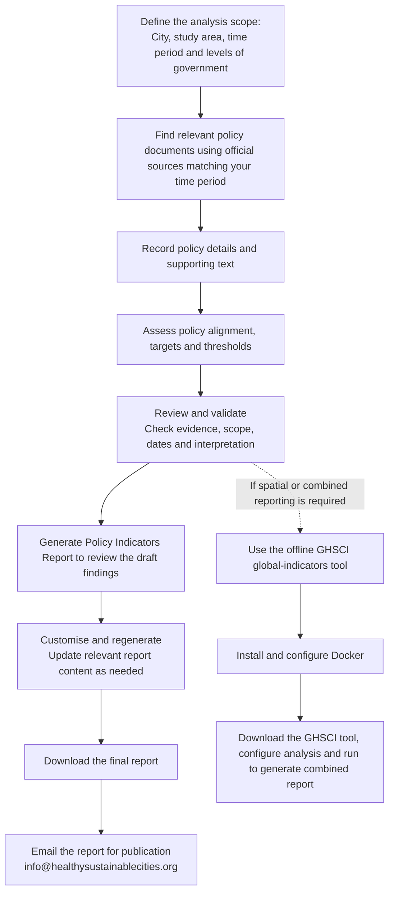
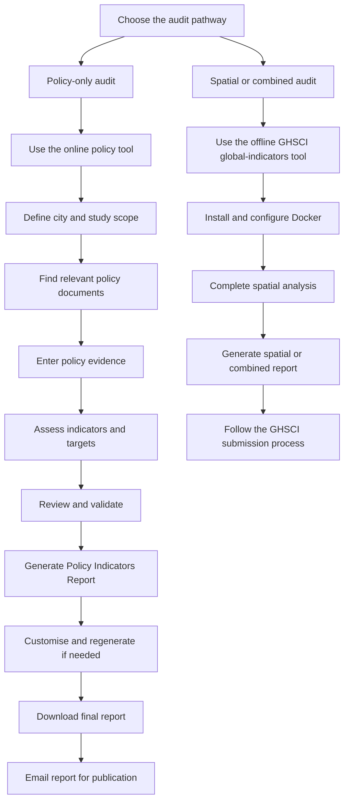

# Online policy audit tool documentation plan

The drafts below are designed to replace spreadsheet-specific instructions while retaining the original audit methodology.

---

## 1. In-app welcome message

## Revised welcome message

# GHSCI Policy

## Global Healthy and Sustainable City Indicators Policy analysis and reporting tool

Welcome to **GHSCI Policy**, the online policy analysis and reporting tool developed for the **Global Observatory of Healthy and Sustainable Cities’ 1000 Cities Challenge**.

Public policies are essential for supporting the design and creation of healthy and sustainable cities and neighbourhoods. GHSCI Policy helps you assess the **presence and quality of recommended policies** for your city, metropolitan area or jurisdiction.

The tool guides you through the collection and assessment of policy evidence across the 1000 Cities Challenge policy indicators. You can document relevant government policies, plans, strategies, guidelines, regulations and legislation; assess their alignment with healthy and sustainable city principles; and record measurable targets and supporting evidence.

Once your assessment is complete, GHSCI Policy allows you to customise, generate and regenerate a **Policy Indicators Report** and city scorecard. These outputs summarise the policy indicators for your city and are designed to support local understanding, advocacy, policy improvement and further research.

### Before you begin

We recommend that you:

- Identify the city, metropolitan area or jurisdiction to be assessed.
- Consider the relevant levels of government and policy responsibilities.
- Assemble current, formally adopted policy documents and other official sources.
- Involve people with local knowledge of the policy context.
- Arrange for local review or validation of the assessment where possible.
- Familiarise yourself with the policy indicators and assessment guidance.

GHSCI Policy is designed for **policy-only analysis** and does not require local installation of specialist software. If you also wish to assess spatial indicators or generate a combined Policy and Spatial Indicators Report, you will need to use the separate offline **Global Healthy and Sustainable City Indicators (GHSCI) software**.

When you are satisfied with your Policy Indicators Report, download it and follow the current Global Observatory submission process for consideration for publication as part of the **1000 Cities Challenge**.

[Learn more about the 1000 Cities Challenge](https://www.healthysustainablecities.org/1000-cities-challenge/)

---

## 2. In-app workflow

### Audit workflow

Follow these stages to complete your policy audit:

### Choosing the right tool

| Desired outcome | Tool to use |
|---|---|
| Policy Indicators Report | Online policy tool |
| Policy audit without installing local software | Online policy tool |
| Spatial Indicators Report | Offline GHSCI `global-indicators` tool |
| Combined Policy and Spatial Indicators Report | Offline GHSCI `global-indicators` tool |

> The online policy tool is specifically for analysis and reporting of policy indicators.  See our wiki guidance for the [steps required to produce spatial indicators](https://github.com/healthysustainablecities/global-indicators/wiki/2.-Spatial-indicators-and-reporting-software) if these are also of interest.

---

## 3. In-app audit instructions

### Step 1: Define the audit

Enter the details of the city or jurisdiction being assessed.

Where possible, the audit should cover the whole metropolitan area or the area that contains the majority of the metropolitan population. If the audit covers only part of a larger metropolitan area, explain the reason in the study details.

Identify all relevant levels of government. Depending on the policy area, these may include local, metropolitan, regional, state or national government.

If multiple levels of government are relevant, record policies from each level separately.

---

### Step 2: Find relevant policy documents

Identify formally adopted and current policies that apply to the whole, or a substantial part, of the study area.

Relevant documents may include:

- Strategies
- Plans
- Guidelines
- Standards
- Regulations
- Legislation
- Infrastructure or service-delivery policies
- Land-use and transport policies

Useful sources include official government websites, legislation databases, policy repositories, local policy registers and advice from policymakers or practitioners.

Use the policy indicators and their descriptions to guide your search. Search documents using relevant keywords and synonyms. Contents pages, headings and document-search functions can help locate relevant sections.

---

### Step 3: Enter policy evidence

For each relevant policy, record:

- Official policy title
- Responsible government or agency
- Government level
- Adoption or publication year
- Source URL or citation
- Relevant policy text
- Page, section, clause or other location reference
- Additional notes about applicability or interpretation

Quote or accurately summarise the relevant policy content. If the source is not in English, provide an English translation or summary and retain the original source details.

More than one policy may be relevant to an indicator. Add each policy separately rather than combining several documents into one entry.

If an indicator or policy is not relevant to the local context, record this and explain why.

---

### Step 4: Assess policy indicators

Assess whether the policy aim, action or intent aligns with the principles of healthy and sustainable cities.

Base the assessment on the policy evidence you have recorded. Do not assess a policy solely on the basis of its title or general subject matter.

#### Measurable targets

A measurable target is a quantitative standard, threshold or commitment. It may include a delivery timeframe.

Examples may include:

- A specified percentage or proportion
- A distance or maximum travel time
- A numerical infrastructure standard
- A quantified mode-share target
- A target with a defined completion date

General statements such as “promote active transport” or “improve liveability” are not measurable targets unless they include a measurable value or defined threshold.

If a measurable target is present:

1. Record the target exactly or accurately as stated in the policy.
2. Assess whether it is an evidence-informed threshold.
3. Explain the basis for your assessment.
4. Cite relevant research, standards or guidance where appropriate.

If you are unsure, select **Unclear** and explain the uncertainty in the notes. Do not guess.

---

### Step 5: Review and validate

Before generating a final report, review the audit for completeness and consistency.

Check that:

- Policies are formally adopted and current, where relevant.
- Policies apply to the selected study area.
- The responsible government and government level are correct.
- Policy evidence supports each assessment.
- Source URLs or citations are complete.
- Page, section or clause references are included where possible.
- Measurable targets have been recorded accurately.
- Evidence-informed target assessments are explained.
- Unclear or non-applicable items include notes.
- Duplicate policy entries have been avoided.
- Another local reviewer has checked the audit, where possible.

The online tool may identify entries that require review. These prompts are intended to support quality assurance and do not replace local validation.

---

### Step 6: Generate and review your report

Generate a **Policy Indicators Report** after reviewing and validating your entries.

Read the report carefully and check that:

- The city and study area are correctly identified.
- The report reflects the intended audit period.
- The policy findings are plausible.
- Important local context is accurately represented.
- Limitations and uncertainties are acknowledged.

You can return to the audit, update entries and regenerate the report until the content is satisfactory.

The report should be treated as a tool to support policy review, advocacy and further research. It should not be interpreted without considering the local policy context and the limitations of the available evidence.

---

### Step 7: Finalise and submit your report

When you are satisfied with the report:

1. Complete or review the contextualised summary.
2. Download the final Policy Indicators Report.
3. Email the report to `info@healthysustainablecities.org` for consideration for publication.

An online submission pathway is planned but is not currently implemented. Until it becomes available, reports must be downloaded and emailed.

---

## 4. In-app field-help drafts

| Field | Help text |
|---|---|
| **Policy title** | Enter the official title of the policy document. |
| **Government level** | Identify the level of government responsible for adopting, administering or enforcing the policy. |
| **Responsible organisation** | Enter the government department, agency or authority responsible for the policy. |
| **Year** | Enter the year the policy was adopted or published. |
| **Source URL or citation** | Provide an official, stable URL or a complete citation. |
| **Relevant policy content** | Quote or summarise the text that supports your assessment. Include a page, section, clause or other location reference where possible. |
| **Policy applies to study area** | Confirm that the policy applies to the city, metropolitan area or jurisdiction being assessed. |
| **Measurable target** | Select Yes only if the policy includes a quantitative standard, threshold or time-bound commitment. |
| **Target text** | Copy the relevant target as stated in the policy. |
| **Evidence-informed threshold** | Assess whether the target is supported by accepted standards or research evidence. Select Unclear if you cannot determine this confidently. |
| **Explanation** | Explain why the target is or is not considered evidence-informed. Cite relevant standards or research where appropriate. |
| **Other information or notes** | Record uncertainty, non-applicability, implementation status, translation issues or other relevant context. |

---

## 5. Draft validation checklist

Before finalising the audit, confirm that:

- [ ] The study area and audit period are clearly defined.
- [ ] Relevant government levels have been considered.
- [ ] Policy documents are official, current and formally adopted where applicable.
- [ ] Each policy entry includes sufficient source information.
- [ ] The policy evidence relates directly to the indicator being assessed.
- [ ] Multiple relevant policies have been recorded separately.
- [ ] Measurable targets have not been confused with general aspirations.
- [ ] Target text has been copied accurately.
- [ ] Evidence-informed threshold assessments include an explanation.
- [ ] Unclear and non-applicable items include notes.
- [ ] A second reviewer has checked the audit, where possible.
- [ ] The draft report has been reviewed before download.
- [ ] The final report includes an appropriate contextualised summary.

---

# Wiki draft structure and content

## Page 1: Policy Indicators overview

### Purpose

The Policy Indicators assess the presence and quality of government policies that support healthy and sustainable cities and neighbourhoods.

The results can be used to:

- Identify policy strengths and gaps
- Support local advocacy
- Inform policy review and planning
- Provide context for healthy and sustainable city research
- Contribute to the Global Observatory of Healthy and Sustainable Cities

The audit assesses policy content. It does not, by itself, assess whether policies have been implemented or whether intended outcomes have been achieved.

### What is meant by “policy”?

Policy is used broadly to describe decisions taken by governments responsible for planning or delivering urban infrastructure, services and land uses.

Policy documents may include:

- Strategies
- Plans
- Guidelines
- Standards
- Regulations
- Legislation
- Infrastructure and service-delivery policies

---

## Page 2: Completing an audit using the online tool

The online policy tool is available at:

[https://policy.healthysustainablecities.org](https://policy.healthysustainablecities.org)

It is primarily intended for users who want to conduct a policy audit without conducting spatial analysis or installing and configuring software on their local computer.

The online tool allows users to:

- Enter policy evidence online
- Save and review their work
- Customise report content
- Generate and regenerate a Policy Indicators Report
- Download a final policy report

Follow these stages:

1. Define the audit.
2. Identify relevant policy documents.
3. Enter policy evidence.
4. Assess policy indicators and targets.
5. Review and validate the audit.
6. Generate and review the Policy Indicators Report.
7. Download and submit the final report.

---

## Page 3: Combined and spatial reporting

Use the separate offline GHSCI `global-indicators` tool if you require:

- Spatial indicator analysis
- A Spatial Indicators Report
- A combined Policy and Spatial Indicators Report

The GHSCI tool requires local installation and configuration, including Docker.

The online policy tool currently generates policy-only reports. It does not generate spatial indicators or combined reports.

---

## Page 4: Submitting a report for publication

After reviewing and finalising a Policy Indicators Report:

1. Download the report from the online policy tool.
2. Confirm that the contextualised summary is complete.
3. Email the final report to `info@healthysustainablecities.org`.

An online publication-submission pathway is planned but is not currently available. Until it is implemented, reports must be submitted by email.

For combined or spatial reports generated using the offline GHSCI tool, follow the relevant submission instructions provided for that tool.

---

# FAQ draft

### Can I complete a policy-only audit online?

Yes. The online policy tool is designed for policy-only audits and does not require users to install Docker or configure software on their local computer.

### Can the online tool generate spatial indicators?

No. Spatial indicator analysis requires the offline GHSCI `global-indicators` tool.

### Can the online tool generate a combined Policy and Spatial Indicators Report?

No. Combined reports must be generated using the offline GHSCI `global-indicators` tool.

### Can I regenerate my report?

Yes. You can update your entries and regenerate the Policy Indicators Report until you are satisfied with the content.

### Do I need to complete the Excel workbook?

No. The online tool replaces the previous spreadsheet-based workflow for policy-only audits. Spreadsheet instructions should be treated as legacy guidance unless you are using the older workflow.

### What if a policy is unclear or not applicable?

Select **Unclear** where the evidence cannot support a confident assessment and explain the uncertainty in the notes. If a policy or indicator is not relevant to the study area, record this and explain why.

### How do I submit my report for publication?

Currently, download the final report and email it to `info@healthysustainablecities.org`. An online submission pathway is planned but is not currently implemented.

### Does the audit measure policy implementation?

No. The audit primarily assesses the presence and quality of policy content. Implementation and outcomes may require separate assessment.

---

## Suggested top-down diagram for presentations

This version should remain readable when displayed at reduced size because the workflow is vertical and the two reporting pathways are separated clearly.
